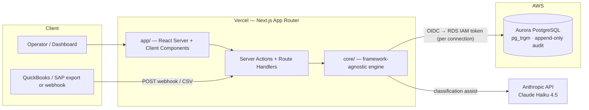
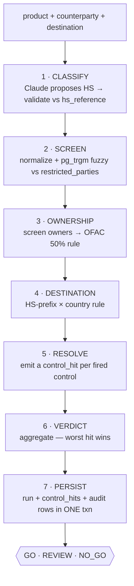
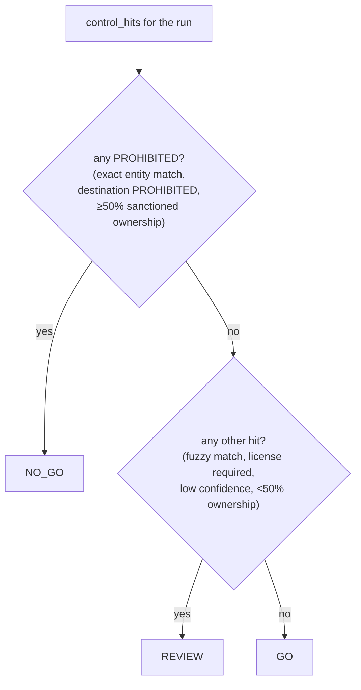
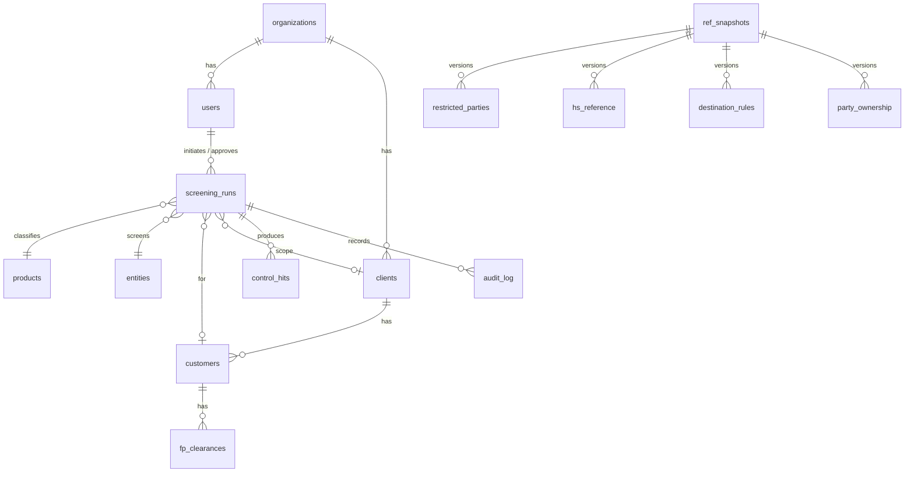
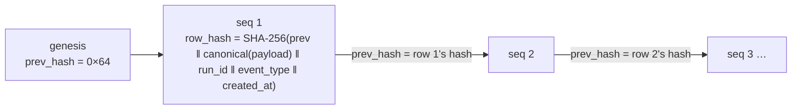
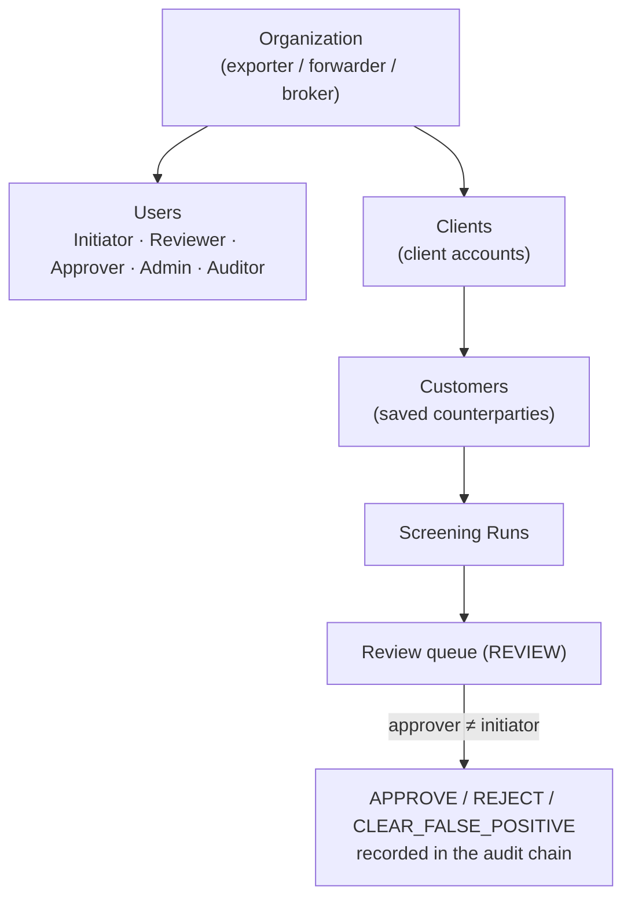
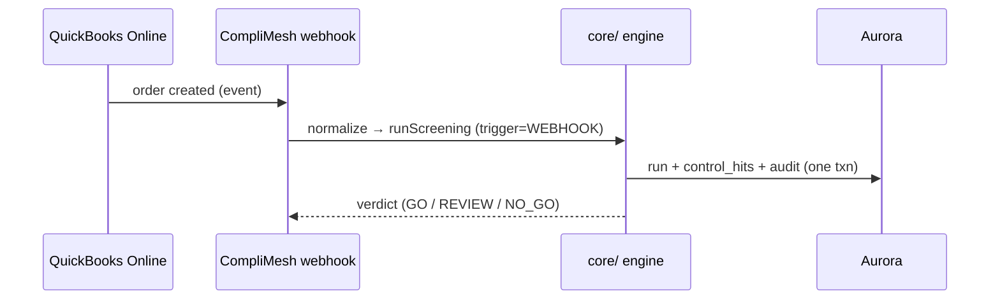

# CompliMesh

**A unified, SMB-tier trade & export compliance engine.** One check answers the
question SMB exporters currently stitch together from three tools plus a
spreadsheet:

> *Can **this product** go to **this company** in **this country**, under current
> rules — and can I prove I checked?*

CompliMesh meshes the three checks competitors leave fragmented —
**classification → restricted-party screening → destination control** (plus
**beneficial-ownership** screening) — into **one verdict** (`GO` / `REVIEW` /
`NO_GO`) and **one tamper-evident audit record**.

Built on **Next.js (Vercel) + Aurora PostgreSQL**, with **Drizzle ORM**,
**`pg_trgm`** fuzzy matching, an **append-only, hash-chained audit log**, and
**Claude** for classification assist.

---

## Table of Contents

- [Why CompliMesh](#why-complimesh)
- [Feature Overview](#feature-overview)
- [Tech Stack](#tech-stack)
- [System Architecture](#system-architecture)
- [The Screening Pipeline](#the-screening-pipeline)
- [Verdict Logic](#verdict-logic)
- [Data Model](#data-model)
- [Tamper-Evident Audit Log](#tamper-evident-audit-log)
- [Multi-Tenancy, Roles & Workflow](#multi-tenancy-roles--workflow)
- [Integrations](#integrations)
- [Project Structure](#project-structure)
- [Getting Started](#getting-started)
- [Scripts](#scripts)
- [Demo](#demo)
- [Liability & Positioning](#liability--positioning)
- [Roadmap](#roadmap)

---

## Why CompliMesh

The enterprise tier (SAP GTS, Oracle GTM, Descartes, Thomson Reuters) is locked
up at **$50k+/yr** with multi-quarter implementations. The SMB tier is fragmented
into single-domain tools that don't talk to each other:

- entity/sanctions screeners don't classify products or check destinations,
- classification engines don't screen parties,
- destination controls live in an out-of-date spreadsheet.

**The wedge:** unify the three into one decision + one audit record, for the SMB
exporter who can't afford enterprise GTS.

**Why a relational, transactional database is load-bearing (not decorative):**

> A compliance decision is inherently relational and transactional — a product,
> an entity, a destination, and a ruleset resolve into a single screening verdict
> that must be written **atomically** and preserved as an **immutable, queryable
> audit record**.

---

## Feature Overview

| Capability | What it does |
|---|---|
| **Unified screening** | One run resolves classification + entity + ownership + destination into a single verdict |
| **HS classification** | Claude proposes an HS code; validated against a curated reference (propose-then-validate) |
| **Restricted-party screening** | `pg_trgm` trigram fuzzy match vs a real US Consolidated Screening List (CSL) trim |
| **Beneficial-ownership (50% rule)** | An entity ≥50%-owned by sanctioned parties is blocked even if its name screens clean |
| **Destination control** | HS-prefix × country rules → ALLOWED / LICENSE_REQUIRED / PROHIBITED |
| **Tamper-evident audit log** | SHA-256 hash chain + DB-enforced append-only; a verifier pinpoints any tampered row |
| **Re-screening on list change** | Re-screen the saved customer base against a refreshed list; flag the newly-sanctioned |
| **Roles & segregation of duties** | Approver ≠ initiator; NO-GO not overridable; every decision recorded with the actor |
| **False-positive management** | Clear a fuzzy match with a reason; it won't re-flag |
| **Batch & integrations** | Batch screening, CSV import (QuickBooks/SAP export), and a live webhook trigger |
| **Multi-tenant** | One product serves a solo exporter or a multi-client forwarder |

---

## Tech Stack

| Layer | Choice |
|---|---|
| Framework | Next.js (App Router) — Server Actions / Route Handlers |
| Hosting | Vercel (functions co-located with the DB in AWS) |
| Database | Aurora PostgreSQL (serverless) via the Vercel–AWS native integration |
| DB access | Drizzle ORM (SQL-first) + hand-written SQL for Postgres machinery |
| Auth to DB | OIDC federation + **RDS IAM auth** (short-lived tokens, no static password) |
| Fuzzy matching | `pg_trgm` trigram similarity (GIN index) |
| AI | Claude (`claude-haiku-4-5`) — classification assist only |
| Language | TypeScript throughout |
| Styling | Tailwind v4 · Space Grotesk + Geist Mono (precision-instrument aesthetic) |

---

## System Architecture



**Boundary discipline:** `core/` is framework-agnostic (no React/Next imports);
`app/` imports `core/`, never the reverse — so the engine is reusable by a future
mobile app or API tier. The database connection assumes a Vercel-managed AWS role
via OIDC and signs a short-lived RDS IAM token per connection (no credentials in
code or env).

---

## The Screening Pipeline

One screening run = one transaction (the Postgres-transaction showcase: the
verdict and its evidence commit together or not at all).



Every fired control becomes a uniform `control_hit` row (the **resolution
layer**) — so *"why was this blocked?"* is a single-query, provable answer.

---

## Verdict Logic

**Governing principle — asymmetric, review-biased.** A false negative (clearing
something that should stop) is catastrophic; a false positive is friction. So
**GO is earned**, never a default, and **a fuzzy match never auto-prohibits**.



| Control | Band / condition | Hit → verdict |
|---|---|---|
| Entity (`pg_trgm`) | exact normalized match | PROHIBITED → **NO_GO** |
| Entity | confident/grey fuzzy (0.3–0.95) | FUZZY_MATCH → **REVIEW** |
| Ownership | ≥50% sanctioned owners | PROHIBITED → **NO_GO** |
| Ownership | >0% and <50% | OWNERSHIP_RISK → **REVIEW** |
| Destination | rule = PROHIBITED | PROHIBITED → **NO_GO** |
| Destination | rule = LICENSE_REQUIRED | LICENSE_REQUIRED → **REVIEW** |
| Classification | confidence below floor (~0.6) | LOW_CONFIDENCE → **REVIEW** |
| — | zero hits | **GO** |

---

## Data Model

Reference data enters in **source-shaped** tables (honest to each feed) and is
**versioned per source** (`ref_snapshots` scoped by `source_type`) so every
verdict is reproducible against the exact rules used. Every screening run is
scoped to an org/client/customer.



**Tables (15):** `organizations`, `users`, `clients`, `customers`,
`fp_clearances`, `ref_snapshots`, `restricted_parties`, `hs_reference`,
`destination_rules`, `party_ownership`, `products`, `entities`, `screening_runs`,
`control_hits`, `audit_log`.

**Deliberate Postgres usage:** FKs + CHECK constraints (a verdict can't exist
without its inputs), `pg_trgm` GIN index for fuzzy search, JSONB for flexible
control flags / audit payloads, per-source versioned snapshots, and an
append-only hash-chained audit table.

---

## Tamper-Evident Audit Log

Two layers defend different threats and combine into one claim:

> *The application physically cannot alter the audit log, and even direct
> database tampering is mathematically detectable.*

- **Layer B — prevention:** `REVOKE UPDATE, DELETE ON audit_log` + a
  `BEFORE UPDATE OR DELETE` trigger that raises an exception.
- **Layer C — evidence:** each row stores `prev_hash` + `row_hash`; altering any
  historical row breaks its hash and every subsequent link.



Implementation rules that matter: **deterministic canonical serialization**
(sorted keys — never hash raw JSONB), **serialized appends** (a
transaction-scoped advisory lock on the chain tip), and a **single global chain**
ordered by `seq`. A `verifyAuditChain()` reader recomputes every hash and returns
the first broken `seq` (`pnpm db:verify`, or the "Verify chain" UI action). See
[`scripts/tamper-demo.sql`](scripts/tamper-demo.sql) for the demo runbook.

> **Honest scope:** tamper-*evidence* for single-record edits + app-level
> tamper-*prevention*. It does not defend against a full chain rewrite from
> genesis — that needs external notarization (roadmap).

---

## Multi-Tenancy, Roles & Workflow

One product, multi-tenant and role/scope-aware — the same screening experience
serves a solo exporter and a multi-client forwarder.



- **Segregation of duties:** the approver of a flagged shipment may not be its
  initiator; a `NO_GO` is not overridable. Each decision is appended to the
  tamper-evident ledger with the actor and role.
- **Re-screening on list change:** load a refreshed CSL snapshot, re-screen the
  saved book, and surface only the *newly* sanctioned customers.

> The demo uses a **user-switcher** (no login) to showcase the role model; real
> auth/RBAC is roadmap.

---

## Integrations

Bring screening to where orders already live (see the **Integrations** tab):

- **CSV import** — upload a QuickBooks / SAP export; columns auto-mapped
  (product / counterparty / destination); screen the whole order book.
- **Live webhook** — `POST /api/integrations/quickbooks/webhook` screens an order
  automatically (no human in the loop). Runs land in the ledger as
  `trigger=WEBHOOK, actor=SYSTEM` — screening as an automatic control.



---

## Project Structure

```
complimesh/
  app/                      # Next.js App Router
    actions.ts              # Server Actions (thin wrappers over core/)
    dashboard/              # the app (Server Component + client shell)
    api/integrations/…      # webhook Route Handler
  core/                     # FRAMEWORK-AGNOSTIC engine (no React/Next)
    schema/                 # Drizzle schema + IAM-auth db client
    screening/              # classify · screen · ownership · destination · verdict · pipeline · rescreen · workflow
    audit/                  # hash chain + verifier
    tenancy.ts              # orgs / users / clients / customers
    types/                  # API-contract types
  components/               # React UI (dashboard views, verdict readout, …)
  lib/                      # client-safe helpers (csv, verdict, cn)
  migrations/
    drizzle/                # generated schema migrations
    sql/                    # hand-written: pg_trgm, GIN, REVOKE, trigger
  scripts/                  # migrate · seed · verify-chain · tamper-demo.sql
```

---

## Getting Started

### Prerequisites
- Node 20+ and `pnpm`
- A Vercel project with **Aurora PostgreSQL** attached via the Vercel–AWS
  integration (provides OIDC + RDS IAM connection env vars)
- (Optional) an `ANTHROPIC_API_KEY` for real LLM classification

### Setup

```bash
pnpm install

# Pull DB connection env vars (OIDC + RDS IAM) from Vercel:
vercel link
vercel env pull .env.local
# Add ANTHROPIC_API_KEY=… to .env.local for LLM classification (optional —
# a deterministic keyword fallback runs without it)

pnpm db:migrate     # Drizzle schema + hand-written Postgres machinery
pnpm seed           # reference data + demo tenant + screening history
pnpm dev            # http://localhost:3000  (dashboard at /dashboard)
```

> **Connection note:** the Vercel AWS integration uses short-lived RDS IAM tokens,
> not a static connection string — `core/schema/db.ts` assumes the role via OIDC
> and signs a token per connection. Locally this needs the `VERCEL_OIDC_TOKEN`
> from `vercel env pull`; re-pull if it expires.

---

## Scripts

| Command | Description |
|---|---|
| `pnpm dev` | Run the app locally |
| `pnpm build` | Production build |
| `pnpm db:generate` | Generate a Drizzle migration from the schema |
| `pnpm db:migrate` | Apply schema migrations + Postgres machinery (incremental) |
| `pnpm db:verify` | Recompute the audit chain; report intact / first broken `seq` |
| `pnpm db:studio` | Drizzle Studio |
| `pnpm seed` | Rebuild the demo DB to a known state |

---

## Demo

The recording walks: a unified screening → the differentiators (ownership 50%
rule, re-screening) → segregation of duties → the audit trail and the
**tamper-detection moment** → the database justification. Full shot list:
`demo-script.md` (kept locally). Tamper runbook: [`scripts/tamper-demo.sql`](scripts/tamper-demo.sql).

Demo verdicts (curated data):

| Counterparty | Why |
|---|---|
| `Bremer Elektronik GmbH` + laptop → **GO** | clean entity, EU destination |
| `Mahan Air` + turbine → **NO_GO** | exact OFAC match + Iran prohibited |
| `Hikvison Digital` + thermal cam → **REVIEW** | fuzzy match + license required |
| `Crescent Dynamics FZE` → **NO_GO** | clean *name*, 51% owned by Rosoboronexport (50% rule) |
| `Pacific Components Ltd` → **GO → NO_GO** | flips after "Refresh list & re-screen" |

---

## Liability & Positioning

Output is **compliance research / decision support**, not a final classification
or legal determination. A `REVIEW` / `NO_GO` means *stop and consult* — the tool
never green-lights a borderline call silently. Entity screening runs against the
real US Consolidated Screening List; classification and destination rules use a
curated demo dataset, extended in production the same way.

---

## Roadmap

- Real beneficial-owner data feeds (production-grade 50%-rule)
- Live scheduled CSL refresh; external notarization of the audit chain tip
- Real auth / RBAC (replacing the demo user-switcher)
- ECCN / dual-use classification, license management
- Real ERP/shipping integrations → an autonomous compliance agent that screens
  on order events and blocks non-compliant shipments before they ship

---

*Decision support, not a legal determination.*
